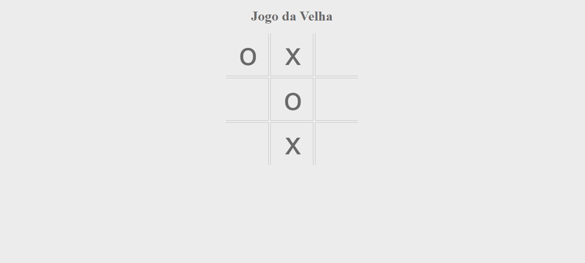

<h1 align="center"> Jogo da Velha. </h1>

Aplicação feita a partir de um dos meus jogos favoritos, com o intuíto de ser um bom Passatempo.  

  <a href="#-tecnologias">Tecnologias</a>&nbsp;&nbsp;&nbsp;|&nbsp;&nbsp;&nbsp;
  <a href="#-projeto">Projeto</a>&nbsp;&nbsp;&nbsp;|&nbsp;&nbsp;&nbsp;
  <a href="#-layout">Layout</a>&nbsp;&nbsp;&nbsp;|&nbsp;&nbsp;&nbsp;
  <a href="#memo-licença">Licença</a>

  

 

  

## 🚀 Tecnologias

Esse projeto foi desenvolvido com as seguintes tecnologias:

- HTML e CSS
- JavaScript
- Git e Github

## 💻 Projeto

Feita para constituir um maior conhecimento em JavaScript, atrelado a um bom momento de nostalgia.

- [Acesse o projeto finalizado, online](https://kiqprado.github.io/JogoDaVelha/)

## memo: Licença

---

@kiqprado